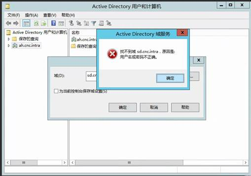
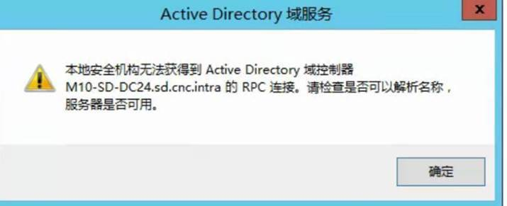

# 站点的AD-Trust-损坏导致Kerberos验证失败 | 454 4.7.0 Temporary Authentication Failure

***Case ID: 17388217***

## 问题描述

中心站点**HQ**在根域`cnc.intra`，部署了 _Exchange 2013_。

分站点**SD**在子域`sd.cnc.intra`，部署了 _Exchange 2010_。

在联通环境中，所有分站点的进出邮件，都要通过中心站点**HQ**。

分站点**SD**的所有的入站邮件都无法到达，卡在**HQ**站点的Exchange 上，报错为：`454 4.7.0 Temporary authentication failure`

``` pwsh-session hl_lines="10"
C:\Windows\system32\Get-Queue M10-HQ-MLCEN01\50: f1

RunspaceId                : 5585d8f5-****-****-****-*********
DeliveryType              : SmtpRelayMailboxDeliveryGroup
NextHopDomain             : site:shandong; version: 14
TIsDomain                 : 
SNextHopConnector         : 00000000-****-****-****-************
Status:                   : Retry
MessageCount              : 12481
LastError                 : [<LRI-2019/11/4 13:31:03>; <led-451 4.4.0 Primary target IP address responded with: "454 4.7.0 Temporary authentication failure." Attempted to alternate host, but that did not succeed. Either there are no alternate hosts, or delivery failed to all alternate hosts. The last endpoint attempted was 10.**.**.***:**>;<FQDN-M10-SD-MLCH07.sd.cnc.intra>;<IP=10.**.**.***>]
RetryCount                : 13
LastRetryTime             : 2019/11/4 13:31:03
NextRetryTime             : 2019/11/4 13:41:05
```

## 问题原因

SD站点与HQ站点的AD Trust 损坏，导致站点间Kerberos验证失败。

## 解决办法

在根域`cnc.intra`的DC上重置它与子域`sd.cnc.intra`的`trust`:

``` powershell
netdom trust cnc.intra /Domain:sd.cnc.intra /UserD:<cnc Administrator> /PasswordD:* /UserO:<sd  administrator> /PasswordO:* /Reset /TwoWay
```

## 排查过程

### 检查站点`SMTP Send/Receive log`

HQ站点`SMTP Send log`中看到所有与**SD**站点的session之间都是显示：`Outbound Authentication failed with LogonDenied`

``` pwsh-session hl_lines="19"
2019-11-04T06:00:35.402Z,组织内 SMTP 发送连接器,08D760DF231F00BC,27,10.**.**.31:37964,10.**.**.168:25,*,,"TLS protocol SP_PROT_TLS1_0_CLIENT negotiation succeeded using bulk encryption algorithm CALG_AES_256 with strength 256 bits, MAC hash algorithm CALG_SHA1 with strength 160 bits and key exchange algorithm CALG_ECDHE with strength 256 bits"
2019-11-04T06:00:35.402Z,组织内 SMTP 发送连接器,08D760DF231F00BC,28,10.**.**.31:37964,10.**.**.168:25,*,,Received certificate
2019-11-04T06:00:35.402Z,组织内 SMTP 发送连接器,08D760DF231F00BC,29,10.**.**.31:37964,10.**.**.168:25,*,352D244A535D94B576232ECC4A4000CFE06BE106,Certificate thumbprint
2019-11-04T06:00:35.402Z,组织内 SMTP 发送连接器,08D760DF231F00BC,30,10.**.**.31:37964,10.**.**.168:25,>,EHLO M10-HQ-MLCEN01.cnc.intra,
2019-11-04T06:00:35.402Z,组织内 SMTP 发送连接器,08D760DF231F00BC,31,10.**.**.31:37964,10.**.**.168:25,<,250-M10-SD-MLCH04.sd.cnc.intra Hello [10.**.**.31],
2019-11-04T06:00:35.402Z,组织内 SMTP 发送连接器,08D760DF231F00BC,32,10.**.**.31:37964,10.**.**.168:25,<,250-SIZE,
2019-11-04T06:00:35.402Z,组织内 SMTP 发送连接器,08D760DF231F00BC,33,10.**.**.31:37964,10.**.**.168:25,<,250-PIPELINING,
2019-11-04T06:00:35.402Z,组织内 SMTP 发送连接器,08D760DF231F00BC,34,10.**.**.31:37964,10.**.**.168:25,<,250-DSN,
2019-11-04T06:00:35.402Z,组织内 SMTP 发送连接器,08D760DF231F00BC,35,10.**.**.31:37964,10.**.**.168:25,<,250-ENHANCEDSTATUSCODES,
2019-11-04T06:00:35.402Z,组织内 SMTP 发送连接器,08D760DF231F00BC,36,10.**.**.31:37964,10.**.**.168:25,<,250-AUTH NTLM LOGIN,
2019-11-04T06:00:35.402Z,组织内 SMTP 发送连接器,08D760DF231F00BC,37,10.**.**.31:37964,10.**.**.168:25,<,250-X-EXPS EXCHANGEAUTH GSSAPI NTLM,
2019-11-04T06:00:35.402Z,组织内 SMTP 发送连接器,08D760DF231F00BC,38,10.**.**.31:37964,10.**.**.168:25,<,250-X-EXCHANGEAUTH SHA256,
2019-11-04T06:00:35.402Z,组织内 SMTP 发送连接器,08D760DF231F00BC,39,10.**.**.31:37964,10.**.**.168:25,<,250-8BITMIME,
2019-11-04T06:00:35.402Z,组织内 SMTP 发送连接器,08D760DF231F00BC,40,10.**.**.31:37964,10.**.**.168:25,<,250-BINARYMIME,
2019-11-04T06:00:35.402Z,组织内 SMTP 发送连接器,08D760DF231F00BC,41,10.**.**.31:37964,10.**.**.168:25,<,250-CHUNKING,
2019-11-04T06:00:35.402Z,组织内 SMTP 发送连接器,08D760DF231F00BC,42,10.**.**.31:37964,10.**.**.168:25,<,250-XEXCH50,
2019-11-04T06:00:35.402Z,组织内 SMTP 发送连接器,08D760DF231F00BC,43,10.**.**.31:37964,10.**.**.168:25,<,250-XRDST,
2019-11-04T06:00:35.402Z,组织内 SMTP 发送连接器,08D760DF231F00BC,44,10.**.**.31:37964,10.**.**.168:25,<,250 XSHADOW,
2019-11-04T06:00:35.496Z,组织内 SMTP 发送连接器,08D760DF231F00BC,45,10.**.**.31:37964,10.**.**.168:25,*,,Outbound Authentication failed with LogonDenied
```

> **SD**站点的`SMTP Receive log`中也是看到相同的报错。

### **HQ**站点`App log`

**HQ**站点的`App log`中，存在大量`2017 error`：

``` powershell
Time:     11/4/2019 2:30:00 PM
ID:       2017
Level:    Error
Source: MSExchangeTransport
Machine:  M10-HQ-MLCEN01.cnc.intra
Message:  Outbound authentication failed with error LogonDenied for Send connector 组织内 SMTP 发送连接器. The authentication mechanism is ExchangeAuth. The target is SMTPSVC/M10-SD-MLCH02.sd.cnc.intra.
```

### 搜索`454 4.7.0 Temporary authentication failure`文档

根据报错454 4.7.0 Temporary authentication failure搜到了一篇[官方KB](https://docs.microsoft.com/en-US/exchange/troubleshoot/client-connectivity/454-4-7-0-temporary-authentication-failure)，情况都很符合。根据[Resolution](https://docs.microsoft.com/en-US/exchange/troubleshoot/client-connectivity/454-4-7-0-temporary-authentication-failure#resolution)检查SD站点与HQ站点间Exchange/DC时间同步，没有问题。

### `NETTIME`命令检查DC

当在HQ站点执行`NETTIME`命令查**SD**站点DC时，发现在**HQ**站点竟然没法Get到**SD**站点的DC。ADUC中也显示找不到域，原因是*用户名密码不正确*。



### 检查 _Kerberos_

在**HQ**站点抓取网络包后发现 _Kerberos_ 出现了Error（其中`10.**.**.15` 为**SD**站点DC，`10.**.**.31`为**HQ**站点Exchange）

``` pwsh-session linenums="217"
4:15:06 PM 11/4/2019    0.5359109                 10.**.**.31 10.**.**.15     KerberosV5         KerberosV5:TGS Request Realm: SD.CNC.INTRA Sname: SMTPSVC/M10-SD-MLCH01.sd.cnc.intra       {TCP:36, IPv4:35}
4:15:06 PM 11/4/2019    0.5460381                 10.**.**.15     10.**.**.31 KerberosV5         KerberosV5:KRB_ERROR  - KRB_AP_ERR_BAD_INTEGRITY (31)        {TCP:36, IPv4:35}
```

### 检查AS复制

我们检查`cnc.intra`和SD子域的AD复制，发现它们之间可以正常复制对方的分区。

### 检查父域与子域的Trust

我们在父域上检查了它与SD子域的trust ，但是出现如下报错，而从SD子域的DC上验证到父域的DC则是正常的。



### 运行`NLTEST`

我们同时尝试在父域的DC上运行`NLTEST /dclist:sd.cnc.intra`查询SD的DC列表也出现以下报错，由于DSGETDC function需要bind DC，而在没有Trust或Trust损坏的情况下都会出现如下报错：

``` doscon
C:\>NLTEST /dclist:sd.cnc.intra
获得域"sd.cnc.intra"中DC的列表<从"\\M10-SD-DC24.sd.cnc.intra"中>。
你没有权限访问到 sd.cnc.intra <\\M10-SD-DC24.sd.cnc.intra> 的DsBind <尝试 NetServerEnum>。
I_NetGetDCList 失败：Status = 6118 0x17e6 ERROR_NO_BROWSER_SERVERS_FOUND
```

### 重置Trust

我们在SD域的DC上运行

``` doscon
NETDOM TRUST <parent domain> /Domain:<child domain> /UserD:<child domain admin>/PasswordD:* /UserO:<parent domain admin> /PasswordO:* /Reset /TwoWay
```

成功重置Trust

### 测试

在等待两个域的DC成功复制到变更后，Trust 验证成功并且之前出现的AD报错消失。邮件流恢复正常。

## Q&As

> ***Q: 如何验证AD Trust？***

> A:
> `NLTEST` to [test the trust relationship between a workstation and domain](https://social.technet.microsoft.com/wiki/contents/articles/16067.nltest-to-test-the-trust-relationship-between-a-workstation-and-domain.aspx)
> Use `NLTEST` to [test domain trust relationship](https://gallery.technet.microsoft.com/Use-NLTEST-to-test-domain-1a752686)
